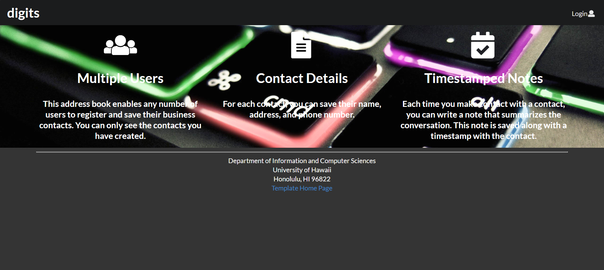

Digits is an application that allows a user to store contacts and timestamped notes related to those contacts to record various details and actions with each contact. 

## Installation

First, [install Meteor](https://www.meteor.com/install).

Second, go to the [project website](https://github.com/LumD2000/digits) and download the repository to your local system.

Third, cd into the app/ directory of your local copy of the repo, and install third party libraries with:

```
$ meteor npm install
```

## Running the system

Once the libraries are installed, you can run the application by invoking the "start" script with:

```
$ meteor npm run start
```


### Viewing the running app

If all goes well, the template application will appear at [http://localhost:3000](http://localhost:3000).  You can login using the credentials in [settings.development.json](https://github.com/ics-software-engineering/meteor-application-template-react/blob/master/config/settings.development.json), or else register a new account.

## Walkthrough

There are several pages in this application: 

### Landing page

The first page a user sees when they start up the program for the first time. It gives details on the application itself and allows users to login or sign up for an account. 

### Add Contact

Once logged in, the user will have access to this page, which allows them to create a new contact with various parameters, such as name and address, and have it stored in the database.

### List Contact

This page lists all the available contacts that the user has logged using the Add Contact page. Here, the user can edit details about each contact, as well as create time-stamped notes for each contact. 

### Admin

This page is designated specifically for admin users, and gives them access to every contact in the database.